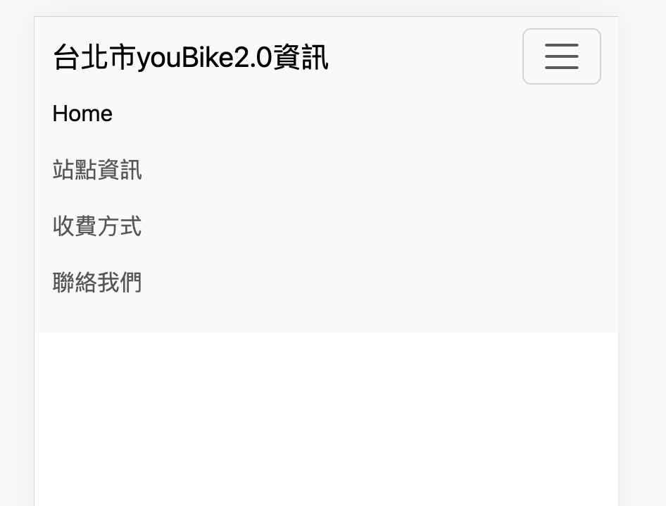
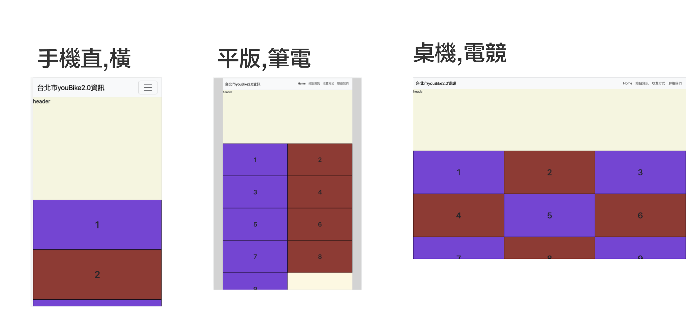
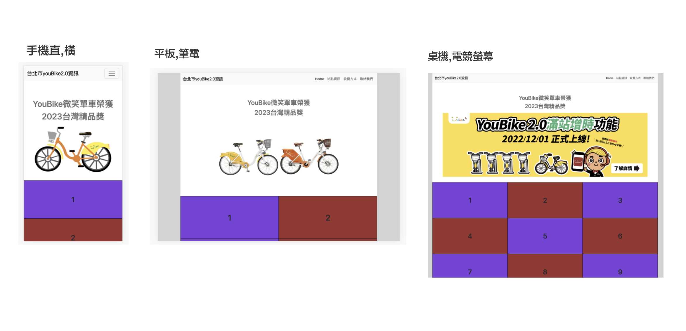

# 網頁驗收第1階段-得分60分
### 第1部份 github repo 的建立和成為web Server

1. ### 使用gh指令建立github的repo
  - gh repo create my-project --public --clone
  
2. ### 上傳網頁至githus

3. ### 將github設定為page,首頁名稱使用index.html

### 第2部份建立頁面根容器(root)在各種viewport的最大寬度

1. ### 套用bootstrap的css和js檔
   
2. ### 建立導覽列(使用bootstrap的navbar)
   
    - 手機直向和橫向才出現**導覽列按鈕**
  
   

# 網頁驗收第2階段-得分70分
## 製作Responsive Web Design (RWD)的內容

1. ### 建立html的layout-header,content,footer
    - 使用display:grid
  
2. ### 建立content內,9個section區
   

# 網頁驗收第3階段-得分80分
## 製作Responsive Web Design (RWD)-header,fooder

### header部份

### fooder部份

